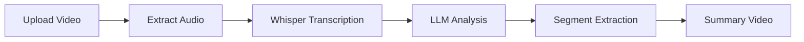

# 🎬 AI Video Summarizer

[](https://python.org)
[](https://flask.palletsprojects.com)
[](https://openai.com)
[](https://github.com/openai/whisper)

An intelligent video summarization platform that extracts key segments from videos using advanced speech analysis and LLM-powered content understanding. Transform long videos into concise, meaningful summaries automatically.


## ✨ Features

### 🎯 Core Capabilities
- **🎤 Word-level Timestamp Extraction**: Uses Whisper AI to generate precise word-level timestamps
- **🧠 LLM-Powered Analysis**: Leverages OpenAI GPT to identify the most important video segments
- **✂️ Automatic Video Editing**: Creates summary videos by extracting and concatenating key segments
- **🔄 Fallback Mode**: Works without API keys using heuristic-based segment selection
- **🌐 Web Interface**: Beautiful Flask-based web application for easy video uploads
- **📱 Responsive Design**: Works seamlessly on desktop and mobile devices

### 🚀 Advanced Features
- **📊 Video Analytics**: Detailed segment analysis with importance scoring
- **🎨 Modern UI**: Clean, intuitive interface with real-time processing updates
- **📁 Sample Library**: Pre-loaded sample videos for testing different content types
- **⚡ Fast Processing**: Optimized pipeline for quick video summarization
- **🔒 Privacy First**: All processing happens locally on your machine


## 🛠️ How It Works



1. **🎵 Audio Extraction**: Extracts audio from input video and generates word-level timestamps using Whisper
2. **🔍 Content Analysis**: Sends transcript with timestamps to LLM for intelligent segment identification
3. **🎬 Video Assembly**: Extracts identified segments and concatenates them into a summary video
4. **⏱️ Context Preservation**: Maintains temporal relationships and smooth transitions

## 📦 Installation

### Prerequisites
- Python 3.8+
- FFmpeg (for video processing)

### Quick Start
```bash
# Clone the repository
git clone https://github.com/yourusername/video-summarizer-ai.git
cd video-summarizer-ai

# Install dependencies
pip install -r requirements.txt

# Run the web application
python app.py
```

### Environment Setup (Optional)
For enhanced LLM analysis, add your OpenAI API key:

```bash
# Copy environment template
cp .env.example .env

# Edit .env and add your OpenAI API key
OPENAI_API_KEY=your_openai_api_key_here
```

## 🚀 Usage

### 🌐 Web Interface (Recommended)
```bash
python app.py
```
Then open `http://localhost:5000` in your browser.


### 💻 Command Line Interface
```bash
# Basic usage with test video
python video_summarizer_simple.py

# Advanced usage
python video_summarizer.py
```

### 🎮 Playing Generated Videos
```bash
python play_video.py output/summary_video.mp4
```

## 📁 Project Structure

```
video-summarizer-ai/
├── 🌐 app.py                          # Flask web application
├── 🎬 video_summarizer.py             # Main CLI application
├── ⚡ video_summarizer_simple.py      # Simplified version
├── 🎮 play_video.py                   # Video player utility
├── 📋 requirements.txt                # Python dependencies
├── 🔧 .env.example                    # Environment template
├── 📁 templates/                      # HTML templates
├── 📁 static/                         # CSS, JS, images
├── 📁 output/                         # Generated summary videos
├── 📁 samples/                        # Sample videos for testing
├── 📁 screenshots/                    # Application screenshots
└── 📁 uploads/                        # User uploaded videos
```

## 🔧 Dependencies

| Package | Purpose | Version |
|---------|---------|---------|
| **moviepy** | Video editing and processing | 1.0.3 |
| **whisper-timestamped** | Speech-to-text with timestamps | 1.14.2 |
| **openai** | LLM API integration | 1.3.8 |
| **flask** | Web framework | Latest |
| **requests** | HTTP requests | 2.31.0 |

## 📊 Example Output


The system will:
1. 📤 **Upload/Process** your video through the web interface
2. 🎤 **Extract** speech with word-level timestamps
3. 🧠 **Analyze** content to identify key segments
4. ✂️ **Create** a summary video with the most important parts
5. 📊 **Display** segment information and timing details

### Sample Processing Results
```
=== Processing Complete ===
Original video: business_meeting.mp4 (45 minutes)
Summary video: summary_business_meeting.mp4 (8 minutes)
Compression ratio: 82% reduction

Summary segments:
  1. 02:15 - 03:45: Project kickoff discussion (importance: 9/10)
  2. 15:30 - 17:20: Budget allocation review (importance: 8/10)
  3. 28:45 - 31:15: Action items and deadlines (importance: 9/10)
  4. 41:20 - 43:50: Next steps and follow-up (importance: 7/10)
```

## 🎨 Customization

### 🎯 Summarization Styles
- Modify the LLM prompt in `analyze_with_llm()` for different summarization approaches
- Adjust segment length preferences
- Configure importance thresholds

### 🎬 Video Quality Settings
- Change output resolution and bitrate in `create_summary_video()`
- Adjust compression settings for different use cases
- Configure audio quality parameters

### 🎨 UI Customization
- Modify templates in `templates/` directory
- Update styling in `static/css/`
- Add custom branding and themes

## 🤝 Contributing

We welcome contributions! Please see our [Contributing Guidelines](CONTRIBUTING.md) for details.

1. Fork the repository
2. Create a feature branch (`git checkout -b feature/amazing-feature`)
3. Commit your changes (`git commit -m 'Add amazing feature'`)
4. Push to the branch (`git push origin feature/amazing-feature`)
5. Open a Pull Request

## 📄 License

This project is licensed under the MIT License - see the [LICENSE](LICENSE) file for details.

## 🙏 Acknowledgments

- [OpenAI Whisper](https://github.com/openai/whisper) for speech recognition
- [OpenAI GPT](https://openai.com) for content analysis
- [MoviePy](https://github.com/Zulko/moviepy) for video processing
- [Flask](https://flask.palletsprojects.com) for the web framework

## 📞 Support

- 📧 **Email**: support@videosummarizer.ai
- 🐛 **Issues**: [GitHub Issues](https://github.com/yourusername/video-summarizer-ai/issues)
- 💬 **Discussions**: [GitHub Discussions](https://github.com/yourusername/video-summarizer-ai/discussions)

---

<div align="center">
  <strong>⭐ Star this repository if you find it helpful! ⭐</strong>
</div>
